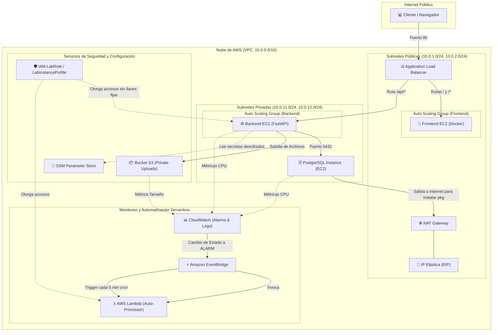

# Informe Técnico de Arquitectura: NexoCloud

## 1. Introducción y Resumen Ejecutivo

Este informe detalla el diseño e implementación de la infraestructura en la nube para **NexoCloud**, una aplicación web estructurada bajo una arquitectura de tres capas (Presentación, Lógica y Datos) con despliegue automatizado en Amazon Web Services (AWS) mediante **Terraform**.

El diseño se alinea estrictamente con los estándares modernos de seguridad, escalabilidad y automatización. Se implementaron redes privadas aisladas para proteger la base de datos PostgreSQL, un balanceador de carga para distribuir el tráfico, almacenamiento de secretos centralizado en SSM Parameter Store y automatización serverless mediante AWS Lambda y EventBridge.

---

## 2. Diagrama de la Arquitectura Implementada

A continuación se muestra el flujo de interacción y seguridad entre los recursos desplegados en AWS:



---

## 3. Detalle de Capas y Servicios

### 3.1 Redes y Comunicaciones (Capa de Red)
* **VPC Privada**: Segmento de red `10.0.0.0/16` aislado.
* **Subredes Públicas**: Dos subredes en distintas Zonas de Disponibilidad (AZ) para asegurar alta disponibilidad. Hospedan al balanceador de carga (ALB) y a los servidores frontend.
* **Subredes Privadas**: Dos subredes aisladas sin asignación de IPs públicas. Hospedan el backend y la base de datos.
* **NAT Gateway**: Dispositivo lógico con IP Elástica (EIP) colocado en la subred pública. Permite que la base de datos privada descargue e instale PostgreSQL en el arranque sin exponerse al exterior.

### 3.2 Seguridad y Secretos (Capa de Seguridad)
* **AWS SSM Parameter Store**: Toda la información sensible del entorno (host de base de datos, contraseñas, bucket S3) se guarda como parámetros de tipo `String` y `SecureString` (contraseña encriptada).
* **IAM LabRole**: Las instancias EC2 y la Lambda consumen este perfil de instancia pre-creado en la cuenta estudiantil, eliminando la necesidad de guardar claves de AWS fijas en el código.

### 3.3 Datos y Almacenamiento (Capa de Almacenamiento)
* **Base de Datos PostgreSQL**: Desplegada en una instancia EC2 t3.small ubicada en la subred privada 1, con un volumen gp3 encriptado de 30 GB.
* **Amazon S3**: Almacenamiento de objetos privado para archivos de usuario, con bloqueo de acceso público y políticas CORS configuradas.

### 3.4 Monitoreo y Automatización (Capa Serverless)
* **CloudWatch**: Mide el consumo de CPU y alertas de tamaño del bucket S3.
* **EventBridge**: Escucha eventos y ejecuta la Lambda cuando hay alertas críticas o de mantenimiento programado (cada 5 minutos).
* **AWS Lambda (Python 3.12)**: Ejecuta diagnósticos en segundo plano sobre la infraestructura.

---

## 4. Retos Técnicos Resueltos y "Gotchas"

Durante el desarrollo de este Terraform se solucionaron problemas complejos de dependencias que garantizaron la robustez del código:

1. **El Bug de Instalación de Postgres (Condición de Carrera)**:
   * *Problema*: Al arrancar la base de datos por primera vez en la subred privada, no podía descargar los paquetes de PostgreSQL porque el NAT Gateway y su tabla de rutas privada aún no terminaban de crearse en AWS, dejando el servidor sin base de datos (`Connection refused`).
   * *Solución*: Se añadió un `depends_on` explícito a la base de datos, forzándola a esperar a que el NAT Gateway y la tabla de enrutamiento privada estén 100% activos antes de encenderse.
2. **Descifrado de SSM SecureStrings**:
   * *Problema*: Al leer el secreto de contraseña desde SSM en el `user_data` del backend, AWS devolvía la clave encriptada (un string largo cifrado), rompiendo la autenticación de la base de datos.
   * *Solución*: Se agregó el parámetro `--with-decryption` en el comando `aws ssm get-parameter` del script de arranque.
3. **Restricción de IAM en Cuentas Escolares**:
   * *Problema*: AWS Academy bloquea la creación de nuevos roles de IAM (`AccessDenied`).
   * *Solución*: Se mapearon todos los recursos para consumir el rol preexistente `LabRole` y el perfil de instancia `LabInstanceProfile`.

---

## 5. Manual de Despliegue y Pruebas (Instrucciones de Ejecución)

El despliegue automatizado de la infraestructura se realiza mediante la siguiente secuencia de comandos y configuraciones:

### Paso 1: Configurar Credenciales de AWS
Las credenciales temporales activas proporcionadas por el laboratorio de AWS deben guardarse en el archivo local de configuración del sistema:
`C:\Users\jeanv\.aws\credentials`
```ini
[default]
aws_access_key_id = ASIA...
aws_secret_access_key = ...
aws_session_token = IQoJ...
```

### Paso 2: Desplegar la Infraestructura
La ejecución del despliegue se inicia desde la consola del sistema con los siguientes comandos:
```powershell
cd terraform
terraform init
terraform apply -auto-approve
```
*Terraform se encarga de crear los 53 recursos en el orden lógico correcto de forma 100% automática.*

### Paso 3: Obtener las Direcciones de Acceso
Al finalizar el despliegue con éxito, la salida de Terraform mostrará en la pantalla las siguientes variables:
* **alb_dns_name**: Enlace para abrir la aplicación web (tanto para el Frontend como para la API).
* **s3_bucket_name**: El nombre del bucket creado dinámicamente.

### Paso 4: Limpieza de Créditos
Con el fin de evitar el consumo de créditos del laboratorio escolar, se debe ejecutar el comando de destrucción al concluir las pruebas:
```powershell
terraform destroy -auto-approve
```
